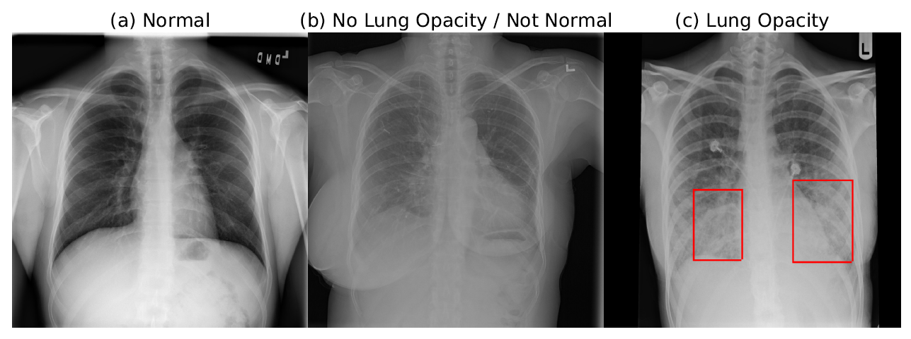
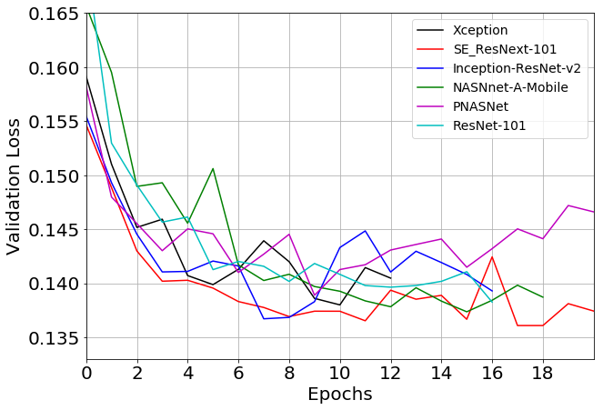

# Deep Learning for Automatic Pneumonia Detection.

Pneumonia is the leading cause of death among young children and one of the top mortality causes worldwide. The pneumonia detection is usually performed through examine of chest X-Ray radiograph by highly trained specialists. This process is tedious and often leads to a disagreement between radiologists. Computer-aided diagnosis systems showed potential for improving the diagnostic accuracy. In this work, we develop the computational approach for pneumonia regions detection based on single-shot detectors, squeeze-and-extinction deep convolution neural networks, augmentations and multi-task learning. The proposed approach was evaluated in the context of the Radiological Society of North America Pneumonia Detection Challenge, achieving one of the best results in the challenge.
Our source code is freely available here.

__For more details, please refer to the [paper](https://arxiv.org/abs/...).__

If you are using the results and code of this work, please cite it as
```
@article{rsna_2020,
  title={Deep Learning for Automatic Pneumonia Detection},
  author={..},
  journal={arXiv preprint arXiv:},
  year={2020}
}
```

## References
This code is based on the original 2nd place solution of Dmytro Poplavskiy, available [here](https://github.com/pdima/kaggle_RSNA_Pneumonia_Detection) and 
the Pytorch RetinaNet implementation from [this repo](https://github.com/yhenon/pytorch-retinanet).


## Dataset
The labelled dataset of the chest X-Ray (CXR) images and patients meta data was publicly provided for the challenge by the US National Institutes of Health Clinical Center. The [dataset](https://www.kaggle.com/c/rsna-pneumonia-detection-challenge) is available on kaggle platform.

The database comprises frontal-view X-ray images from 26684 unique patients. Each image is labeled with one of three different classes from the associated radiological reports: ”Normal”, ”No Lung Opacity / Not Normal”, ”Lung Opacity”. 
Fig. 1 shows examples of all three classes CXRs labeled with bounding boxes for unhealthy patients.


Fig. 1 Examples of ”Normal”, ”No Lung Opacity / Not Normal”, ”Lung Opacity” chest X-Ray (CXR) images.

## Metrics
The evaluation metric was provided in the challenge. The models were evaluated using the mean average precision (mAP) at different intersection-over-union (IoU) thresholds. [See evaluation here.](https://www.kaggle.com/c/rsna-pneumonia-detection-challenge/overview/evaluation).
The implemented metric calculation is in src/metric.py

## Models
The model is based on [RetinaNet](https://github.com/yhenon/pytorch-retinanet) implementation on Pytorch  with few modifications. A number of different base models architectures has been tested. Fig.2 shown validation losses for a range of various backbones. The SE-type nets demonstrated optimal performance, with se-resnext101 showing the best results and se-resnext50 being slightly worse.


Fig. 2 Validation loss history for a range of model encoders.


## Images preprocessing and augmentations
The original images were scaled to 512 x 512 px resolution. The 256 resolution yield degradation of the results, while the full original resolution (typically, over 2000 x 2000 px) was not practical with heavier base models.

Since the original challenge dataset is not very large the images augmentations were beneficial to reduce overfitting. The dataset with augmentations is at ```src/datasets/detection_dataset.py```

## Training
Training All base models used were pre-trained on Imagenet dataset. 
For learning rate scheduler we used available in Pytorch ReduceLROnPlateau with a patience of 4 and learning rate decrease factor of 0.2. SE-ResNet101 demonstrated the best results, followed by SE-ResNet50. The whole training took around 12 epochs, 50 min per epoch on P100 GPU.

## How to install and run

### Preparing the training data
To download dataset from kaggle one need to have a kaggle account, join the competition and accept the conditions, get the kaggle API token ansd copy it to .kaggle directory. After that you may run 
`bash dataset_download.sh` in the command line. The script for downloading and unpacking data is in scripts/dataset_download.sh.

### Prepare environment 
1. Install anaconda
2. You may use the create_env.sh bash file to set up the conda environment
3. Alternative way is to install Docker

### Reproducing the experiments 
Set up your own path ways in config.py.

You can run train_runner.py with bash scripts:
```bash
run_experiments.sh
```
This will **download** the data, **train** the models, **generate** predictions, and **plot** the metrics. Evaluation results will be saved in the directory denoted in condigs.py.

## Inference on your data
Once you have saved checkpoints for the trained models you may call predict.py with the path to your models checkpoint and generate predtions for your test images. 
You may need to change csv file with test images ids, that are loaded in the ```src/datasets/test_dataset.py``` and the test directory is in configs.py

