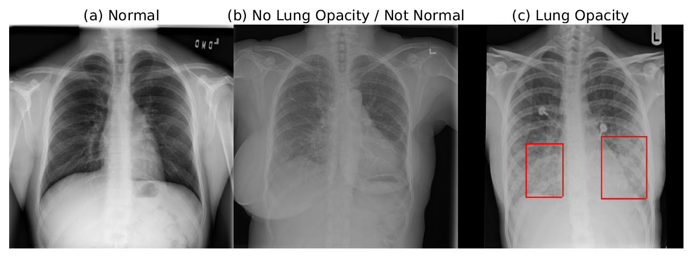
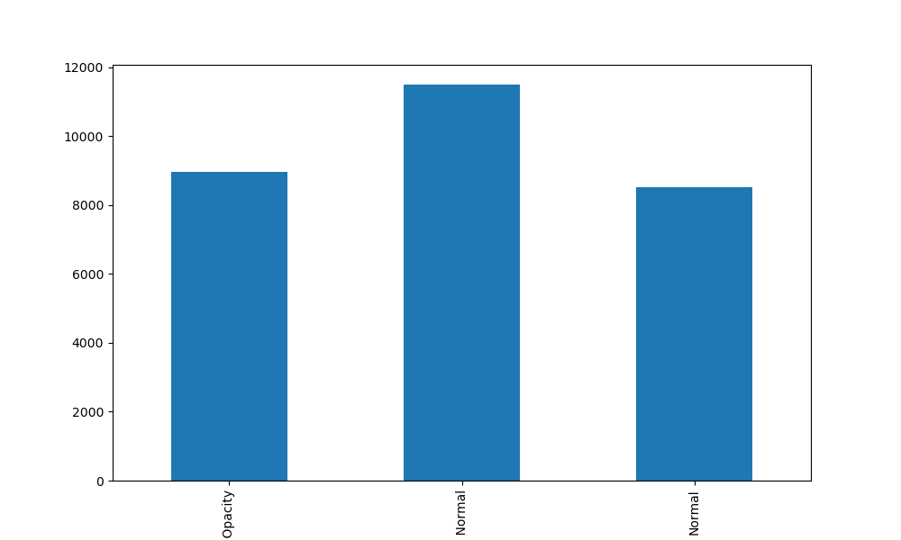
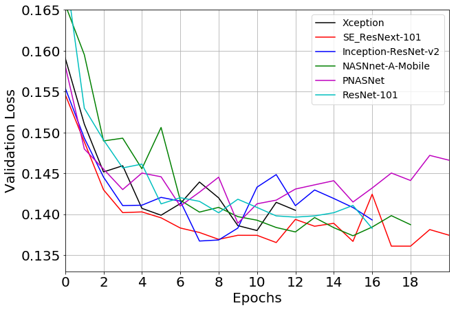

# Deep Learning for Automatic Pneumonia Detection

Pneumonia is the leading cause of death among young children and one of the top mortality causes worldwide. The pneumonia detection is usually performed through examine of chest X-Ray radiograph by highly trained specialists. This process is tedious and often leads to a disagreement between radiologists. Computer-aided diagnosis systems showed potential for improving the diagnostic accuracy. In this work, we develop the computational approach for pneumonia regions detection based on single-shot detectors, squeeze-and-extinction deep convolution neural networks, augmentations and multi-task learning. The proposed approach was evaluated in the context of the Radiological Society of North America Pneumonia Detection Challenge, achieving one of the best results in the challenge.
Our source code is freely available here.

__For more details, please refer to the [paper](https://openaccess.thecvf.com/content_CVPRW_2020/html/w22/Gabruseva_Deep_Learning_for_Automatic_Pneumonia_Detection_CVPRW_2020_paper.html).__

If you are using the results or code of this work, please cite it as:
```
@InProceedings{Gabruseva_2020_CVPR_Workshops,
  author = {Gabruseva, Tatiana and Poplavskiy, Dmytro and Kalinin, Alexandr A.},
  title = {Deep Learning for Automatic Pneumonia Detection},
  booktitle = {Proceedings of the IEEE/CVF Conference on Computer Vision and Pattern Recognition (CVPR) Workshops},
  month = {June},
  year = {2020}
}
```
## References
This code is based on the original [2nd place solution](https://github.com/pdima/kaggle_RSNA_Pneumonia_Detection) by [Dmytro Poplavskiy](https://www.kaggle.com/dmytropoplavskiy) and the [Pytorch RetinaNet](https://github.com/yhenon/pytorch-retinanet) implementation. [RSNA Challenge](https://www.rsna.org/en/education/ai-resources-and-training/ai-image-challenge/RSNA-Pneumonia-Detection-Challenge-2018) was hosted on [Kaggle](https://www.kaggle.com/c/rsna-pneumonia-detection-challenge).

## Hall of Fame: further research that builds on our work
The list of notable papers that implemented and relied on our work:

1. Park, S., Kim, G., Kim, J., Kim, B., & Ye, J. C. (2021). Federated Split Vision Transformer for COVID-19 CXR Diagnosis using Task-Agnostic Training (arXiv:2111.01338). 35th Conference on Neural Information Processing Systems (NeurIPS 2021). https://doi.org/10.48550/arXiv.2111.01338 

2. Kim, E., Lee, S., & Lee, K. M. (2023). Abnormality detection in chest X-ray via residual-saliency from normal generation. IEEE Access, 11, 21799–21810. 
https://doi.org/10.1109/access.2023.3251350 

3. Publication in progress. See this repo https://github.com/amirrezafateh/Multi-Scale-Transformer-Pneumonia

## Disclaimer - UPDATE
This codebase is outdated. In 2025, transformers are all you need :)
For transformer-based solution, see this repo https://github.com/amirrezafateh/Multi-Scale-Transformer-Pneumonia

## Dataset
The labelled dataset of the chest X-Ray (CXR) images and patients' metadata was publicly provided for the challenge by the US National Institutes of Health Clinical Center. The [dataset](https://www.kaggle.com/c/rsna-pneumonia-detection-challenge) is available on Kaggle platform.

The database comprises frontal-view X-ray images from 26684 unique patients. Each image is labeled with one of three different classes from the associated radiological reports: ”Normal”, ”No Lung Opacity / Not Normal”, ”Lung Opacity”. 
Figure 1 shows examples of all three classes CXRs labeled with bounding boxes for unhealthy patients.


Figure 1. Examples of ”Normal”, ”No Lung Opacity / Not Normal”, ”Lung Opacity” chest X-Ray (CXR) images.

The classes were well-distributed


Figure 2. Classes distribution in the training dataset.

## Metrics
The evaluation metric was provided in the challenge. The models were evaluated using the mean average precision (mAP) at different intersection-over-union (IoU) thresholds. [See evaluation here](https://www.kaggle.com/c/rsna-pneumonia-detection-challenge/overview/evaluation).
The implemented mAP metric calculation is in src/metric.py

## Models
The model is based on [RetinaNet](https://github.com/yhenon/pytorch-retinanet) implementation on Pytorch with a few modifications. Several different base models' architectures have been tested. Fig.3 shows validation losses for a range of various backbones. The SE-type nets demonstrated optimal performance, with se-resnext101 showing the best results and se-resnext50 being slightly worse.


Figure 3. Validation loss history for a range of model encoders.

## Images preprocessing and augmentations
The original images were scaled to 512 x 512 px resolution. The 256 resolution yield degradation of the results, while the full original resolution (typically, over 2000 x 2000 px) was not practical with heavier base models.

Since the original challenge dataset is not very large the images augmentations were beneficial to reduce overfitting. The dataset with augmentations is at ```src/datasets/detection_dataset.py```

## Training
All base models used were pre-trained on ImageNet dataset. 
For learning rate scheduler, we used ReduceLROnPlateau with a patience of 4 and a learning rate decrease factor of 0.2. RetinaNet single-shot detectors with SE-ResNet101 encoders demonstrated the best results, followed by SE-ResNet50. The whole training took around 12 epochs, 50 min per epoch on P100 GPU.

## How to install and run

### Preparing the training data
To download dataset from kaggle one need to have a kaggle account, join the competition and accept the conditions, get the kaggle API token ansd copy it to .kaggle directory. After that you may run 
`bash dataset_download.sh` in the command line. The script for downloading and unpacking data is in scripts/dataset_download.sh.

### Prepare environment 
1. Install anaconda
2. You may use the create_env.sh bash file to set up the conda environment
3. Alternative way is to install Docker

### Reproducing the experiments 
Set up your own path ways in config.py.

Run ```src/train_runner.py``` with ```args.action == "train"``` for training the models, 
use ```args.action == "check_metric"``` to check the score, and ```args.action == "generate_predictions"``` to generate predictions.

From predictions you can calculate mAP score for the range of NMS thresholds using ```src/scores.py``` and visualise the saved scres for differnet runs and models by 
```src/visualizations/plot_metrics.py```. 

### Inference on your data
Once you have saved checkpoints for the trained models, you may call  ```src/train_runner.py``` with ```args.action == "generate_predictions"``` with the path to your model checkpoint and generate predictions for your test images. 
The test dataset class is in the ```src/datasets/test_dataset.py``` and the test directory is in ```configs.py```

